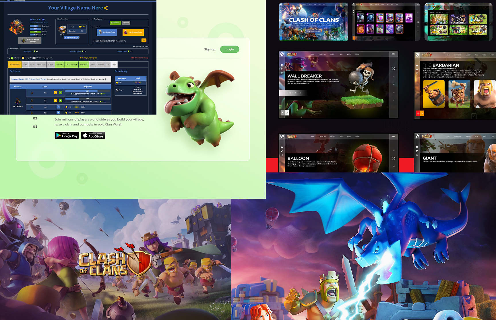
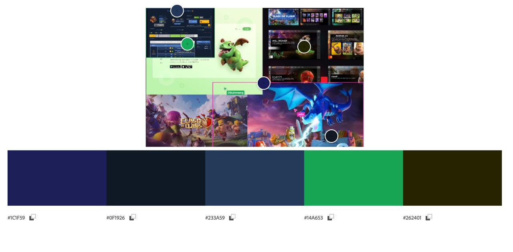

# TECH24-25
 Eindproject tech (ClashConnect)

# WIKI

Andere concepten

### StockX

ShoeMatch is een app die mensen helpt schoenen te kopen en tegelijkertijd nieuwe mensen te ontmoeten. Gebruikers kunnen hun favoriete schoenen kiezen, waarna het algoritme ze matcht met anderen die dezelfde smaak hebben. Het draait dus om het vinden van een connectie op basis van gedeelde modevoorkeuren, in plaats van alleen maar profielen. Het biedt een leuke manier om zowel je stijl te laten zien als iemand te vinden die daarin past.

### SoloMate

SoloMate is een datingplatform speciaal ontworpen voor single ouders die op zoek zijn naar een serieuze relatie met iemand die begrijpt hoe het is om een kind(eren) op te voeden. Traditionele datingapps houden vaak geen rekening met de unieke uitdagingen en prioriteiten van alleenstaande ouders, zoals beperkte tijd en de behoefte aan een partner die begripvol en verantwoordelijk is.

## Gekozen Concept 
Voor Clash of Clans spelers willen wij een maching website maken waarbij spelers kunnen zoeken naar clans. In de game kunnen clans aangeven hoeveel trofeeën, welke stadshuis level ze zijn, in welk land de clan is gevestigd en welke taal er in de clan wordt gesproken om zo de juiste spelers te vinden voor hun clan. Wij willen met onze app/website daarmee helpen. Via ons product kunnen ze een formulier invullen waarbij zij hun eigen gegevens kunnen invullen. De app/website zoekt dan vervolgens naar clans die voldoen aan die criteria.

### Doelgroep
Onze doelgroep bestaat uit gamers die nog geen clan hebben en op een makkelijke en snelle manier een clan willen vinden en joinen. Dit zijn spelers die graag in een community willen spelen, maar geen zin of tijd hebben om eindeloos te zoeken op forums of sociale media.

Kenmerken van de doelgroep:

 * Casual & beginnende spelers: Gamers die net begonnen zijn of af en toe spelen en op zoek zijn naar een gezellige groep om mee te gamen.

 * Competitieve spelers: Spelers die beter willen worden en een serieuze clan zoeken met structuur en actieve leden.

 * Sociale gamers: Mensen die gamen vooral leuk vinden vanwege het sociale aspect en een actieve community willen.

 * Drukke gamers: Spelers met een volle agenda die snel en zonder gedoe een clan willen vinden.

 * Verschillende platformen: De doelgroep kan op pc, console of mobiel gamen, afhankelijk van de game.

### Moodboard

### Kleurenpalet

### Job Stories

### Job Stories

#### 🎯 Zoeken naar een geschikte clan
Als ik een nieuwe Clash of Clans-clan wil vinden die bij mijn speelstijl past,
wil ik snel een lijst met relevante clans krijgen op basis van mijn trofeeën, stadshuisniveau, taal en land,
zodat ik zonder gedoe een clan kan vinden waar ik me thuis voel.

#### 🏆 Filteren op specifieke clanvereisten
Als ik een competitieve clan zoek die past bij mijn niveau,
wil ik filters kunnen instellen op trofeeën, stadshuisniveau en taal,
zodat ik alleen clans zie die aan mijn eisen voldoen.

#### 🌍 Zoeken op taal en regio
Als ik een clan wil vinden waar mijn taal wordt gesproken,
wil ik kunnen filteren op taal en regio,
zodat ik gemakkelijk met andere spelers kan communiceren en een hechtere community kan opbouwen.

#### 📋 Mijn gegevens invullen voor een betere match
Als ik niet zeker weet welke clan bij mij past,
wil ik een formulier kunnen invullen met mijn spelgegevens,
zodat de website automatisch een passende clan voor mij vindt.

#### ⏳ Tijd besparen bij het zoeken naar een clan
Als ik niet veel tijd wil besteden aan het handmatig zoeken naar een clan,
wil ik snel een overzicht van de beste matches krijgen,
zodat ik direct een keuze kan maken zonder eindeloos te scrollen.

### Requirementlist

1. **Clan Zoekfunctionaliteit**
    - Een zoekbalk om clans te vinden op basis van naam of ID.
    - Een geautomatiseerde lijst met relevante clans op basis van trofeeën, stadshuisniveau, taal en land.
    - Sorteringsopties zoals “Meest actieve clans”, “Hoogste trofeeën”, of “Beste match”.

2. **Filteropties voor Clanvereisten**
    - Filters op trofeeën, stadshuisniveau en taal.
    - Mogelijkheid om meerdere filters tegelijk toe te passen.
    - Directe herberekening van resultaten bij aanpassing van filters.

3. **Taal- en Regiofilters**
    - Keuzemenu voor taalinstellingen van de clan.
    - Filter op land of regio om lokale clans te vinden.
    - Weergave van taal en regio in de zoekresultaten.

4. **Automatische Clan Matchmaking**
    - Een formulier waarin spelers hun trofeeën, stadshuisniveau en voorkeuren kunnen invullen.
    - Een algoritme dat op basis van de ingevulde gegevens een passende clan aanbeveelt.
    - Mogelijkheid om suggesties opnieuw te genereren bij veranderde voorkeuren.

5. **Snelle Zoekervaring**
    - Directe weergave van resultaten zonder lange laadtijden.
    - Suggesties voor populaire of aanbevolen clans.
    - Mogelijkheid om een lijst met favorieten op te slaan voor later gebruik.

## Technische Analyse

We gebruiken de API van [Clash of Clans](https://developer.clashofclans.com/#/)